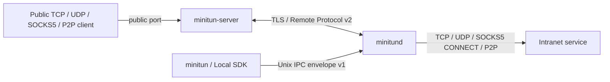

# MiniTun

[](https://github.com/Albert-Li-Sz/MiniTUN/actions/workflows/ci.yml)
[](https://github.com/Albert-Li-Sz/MiniTUN/actions/workflows/sanitizers.yml)
[](https://github.com/Albert-Li-Sz/MiniTUN/actions/workflows/package.yml)
[](LICENSE)

> 中文: [README.md](README.md)

> A minimal-footprint, self-hosted, multi-transport intranet penetration (reverse tunnel)
> tool for Linux.

> **Release status:** [`v1.1.0`](https://github.com/Albert-Li-Sz/MiniTUN/releases/tag/v1.1.0)
> was released on 2026-08-15, adding PROXY protocol headers, the `/v1/*` client policy
> management API with graceful PSK rotation, P2P TCP simultaneous open (NAT hole
> punching), and English documentation on top of v1.0.0. It includes TCP, UDP, SOCKS5
> and P2P tunnel modes, two stable SOVERSION 1 SDKs, and focuses on a minimal footprint:
> no web GUI and no scripting runtime.

MiniTun forwards a TCP or UDP port on a public server to an intranet service, can also
provide a SOCKS5 CONNECT proxy, or negotiate a P2P direct connection for routable hosts and
automatically fall back to relay. The current source consists of the public server
`minitun-server`, the client daemon `minitund`, the local CLI `minitun`, the P2P connector
`minitun-p2p`, and two stable SOVERSION 1 SDKs.

Linux/systemd remains the officially supported runtime target.

## Core capabilities

- Each daemon has a stable `client_id`; the public server configures per client an
  independent PSK, optional certificate SAN/SHA-256 binding, public port ACL, and
  tunnel/connection/idle Worker quotas.
- The triple validation of generation, request ID and `config_revision` guarantees
  deterministic tunnel state convergence after out-of-order, duplicate responses, timeouts
  and disconnects; changing the public port revokes the old listener first.
- Complete server/tunnel create, update, enable, disable, logout, delete commands, plus
  strict-JSON `config export/plan/apply`. apply does not delete by default; `--prune` only
  deletes apply-managed resources.
- `tcp`, `udp`, `socks5`, `p2p` tunnel modes; non-TCP modes are negotiated via capability,
  keeping the old TCP v2 wire image unchanged.
- schema v5 automatically migrates v4 data, preserving stable IDs, names, endpoints,
  tunnels and the original credential references.
- Both client and server can enable `/healthz`, `/readyz`, `/metrics`; metric labels are
  bounded and audit logs never record PSKs, certificate contents, authentication digests or
  user traffic.
- A local-control C11 ABI / C++20 RAII SDK and a Remote Protocol v2 C++20 codec/decoder
  SDK; link via `MiniTun::Client`, `MiniTun::RemoteProtocol` or the corresponding pkg-config
  files, all with SOVERSION 1.
- No web GUI and no scripting runtime (no Node/Python dependency): a single C++20 daemon
  process, an embedded SQLite state database, linking only system OpenSSL and SQLite at
  runtime, with sandbox-hardened systemd units and file-descriptor limits, suitable for
  low-resource environments such as routers, NAS devices and edge hardware.
- DEB/RPM split into client, server, SDK runtime and SDK development; multi-arch OCI,
  SPDX/CycloneDX SBOMs, SHA-256, keyless signing and provenance attestation are also
  published.

## How it works



The public server only knows `client_id`, `tunnel_id` and the public binding, never the
local target address. The current data plane keeps "one relay per one TLS Worker". UDP uses
bounded datagram framing over the authenticated Worker; SOCKS5 only accepts unauthenticated
CONNECT; the P2P direct path authenticates with a one-time token and automatically falls
back to the TLS relay on failure. The direct path upgrades to TLS 1.3 after one-time token
authentication (token as external PSK), so application data is encrypted end to end. The
current P2P does not include ICE/STUN/TURN/NAT hole punching.

## Quick deployment

> Complete installation instructions (signature verification, per-distro package managers,
> OCI, source builds, uninstall and troubleshooting) are in the
> [official installation guide](https://albert-li-sz.github.io/MiniTUN/installation). The
> shortest path follows.

### 1. Install

Download the packages for the target architecture, `SHA256SUMS` and the `.sigstore.json`
bundle from [GitHub Releases](https://github.com/Albert-Li-Sz/MiniTUN/releases), and verify
the checksums and signature first. Release matrix:

| Format | Architectures |
| --- | --- |
| DEB | `amd64`, `arm64`, `armhf`, `riscv64` |
| RPM | `x86_64`, `aarch64`, `armv7hl`, `riscv64` |
| OCI | `linux/amd64`, `linux/arm64`, `linux/arm/v7`, `linux/riscv64` |
| static tar | fully static musl binaries for `x86_64`, `aarch64` (no glibc/OpenSSL runtime dependency) |

Debian/Ubuntu example:

```bash
sudo apt install ./minitun-server_1.0.0_amd64.deb
sudo apt install ./minitun-client_1.0.0_amd64.deb
# development SDK (optional)
sudo apt install ./libminitun-client1_1.0.0_amd64.deb \
  ./libminitun-client-dev_1.0.0_amd64.deb
```

RPM systems install the corresponding `minitun-server`, `minitun-client`,
`libminitun-client1` and `libminitun-client-devel` packages. Packages create dedicated
accounts but do not generate credentials or auto-start services.

### 2. Configure the public server

First obtain the client's stable identity:

```bash
sudo systemctl enable --now minitund.service
minitun daemon identity --json
```

Generate a dedicated PSK for that `client_id` and create a strict JSON policy. The policy
and PSK must both be owned by the `minitun-server` service account; the PSK must not be
readable by group or other users:

```bash
umask 077
openssl rand -hex 32 >team-a.psk
sudo install -d -m 0750 -o minitun-server -g minitun-server \
  /etc/minitun-server/clients
sudo install -m 0600 -o minitun-server -g minitun-server team-a.psk \
  /etc/minitun-server/clients/team-a.psk
sudo install -m 0640 -o minitun-server -g minitun-server clients.json \
  /etc/minitun-server/clients.json
sudo install -m 0644 server.crt /etc/minitun-server/server.crt
sudo install -m 0600 -o minitun-server -g minitun-server server.key \
  /etc/minitun-server/server.key
```

Minimal policy:

```json
{
  "format_version": 1,
  "clients": [
    {
      "client_id": "client_0123456789abcdef0123456789abcdef",
      "enabled": true,
      "psk_file": "/etc/minitun-server/clients/team-a.psk",
      "allowed_ports": ["6000-6099"],
      "max_tunnels": 100,
      "max_connections": 1000,
      "max_idle_workers": 32
    }
  ]
}
```

`certificate_san` or `certificate_sha256` can additionally bind a client certificate; when
enabled you must also configure `--client-ca`, and the PSK is still required. See the
[Configuration documentation](docs/configuration.md) for the complete fields.

Start the server:

```bash
sudo systemctl enable --now minitun-server.service
systemctl status minitun-server.service
```

The default control port is `2333/tcp`. The cloud security group and host firewall must
only allow the public tunnel ports that the policy permits and that are actually used.

### 3. Configure the daemon and tunnel

The following forwards public port `6000` to `127.0.0.1:8080` on the daemon host:

```bash
minitun server add tunnel.example.com:2333 --name edge
minitun server login edge                  # reads the PSK without echo
minitun tun add edge 8080 6000 --name web
minitun tun inspect web --json
```

The current source can also create other modes:

```bash
# UDP: public 6001/udp -> daemon 127.0.0.1:5353/udp
minitun tun add edge 5353 6001 --protocol udp --name dns-udp

# SOCKS5: public 6002/tcp provides CONNECT; local-port is a CLI-compatible placeholder
minitun tun add edge 1 6002 --protocol socks5 \
  --remote-host 127.0.0.1 --name private-proxy

# P2P: create the entry first, then run the connector on the access side
minitun tun add edge 8080 6003 --protocol p2p --name p2p-web
minitun-p2p tunnel.example.com:6003 --listen 127.0.0.1:6501
```

The SOCKS5 `--remote-host` must be a numeric loopback address to prevent accidentally
exposing an open proxy to the public internet. The P2P connector listens on loopback only
by default; use `--allow-non-loopback` only when you explicitly understand the exposure.

Use `--psk-stdin` for piped input:

```bash
minitun server login edge --psk-stdin </secure/path/team-a.psk
```

Once the tunnel's `actual_state` is `active`, the public port is reachable. Synchronization
is asynchronous; if it stays `pending` or `failed`, check `server_actual_state`,
`pending_reason`, `last_error` and the audit logs on both sides.

### 4. Lifecycle and declarative configuration

```bash
minitun server update edge --endpoint tunnel2.example.com:2333 \
  --tls-server-name tunnel2.example.com --ca-file organization-ca.pem
minitun server disable edge
minitun server enable edge
minitun server logout edge

minitun tun update web --local-port 8081 --server-port 6001
minitun tun disable web
minitun tun enable web

minitun config export
minitun config plan /etc/minitun/config.json
minitun config apply /etc/minitun/config.json
minitun config apply /etc/minitun/config.json --prune
```

disable keeps the record; enable automatically restores the desired state. A tunnel's stable
ID and owning server cannot be updated. Re-applying the same config is zero actions and does
not rebuild sessions.

## Operations endpoints

The admin HTTP endpoints are disabled by default. A loopback listener may run without
authentication:

```bash
minitund --admin-listen 127.0.0.1:9091 ...
minitun-server --admin-listen 127.0.0.1:9090 ...
curl --fail http://127.0.0.1:9090/readyz
curl --fail http://127.0.0.1:9090/metrics
```

A non-loopback listener must also provide `--admin-token-file` and should only sit on a
trusted network or behind a TLS reverse proxy. See the
[Operations documentation](docs/operations.md) for details.

## Default paths

| Path | Purpose |
| --- | --- |
| `/run/minitun/minitun.sock` | Unix IPC between the CLI/SDK and the daemon |
| `/var/lib/minitun/state.db` | schema v5 resource state and stable identity |
| `/var/lib/minitun/credentials.db` | daemon private credential database |
| `/etc/minitun-server/server.crt` | server TLS certificate chain |
| `/etc/minitun-server/server.key` | server TLS private key |
| `/etc/minitun-server/clients.json` | per-client policy |

## Documentation

- [Website](https://albert-li-sz.github.io/MiniTUN/)
- [Installation Guide](https://albert-li-sz.github.io/MiniTUN/installation)
- [CLI](docs/cli.md)
- [Configuration & Client Policies](docs/configuration.md)
- [System Architecture](docs/architecture.md)
- [Remote Protocol v2](docs/protocol.md)
- [Local Control & Remote Protocol SDK](docs/sdk.md)
- [Operations & Observability](docs/operations.md)
- [Performance & Soak Validation](docs/performance.md)
- [Development, Testing & Release](docs/development.md)
- [Changelog](docs/changelog.md)

## License

MiniTun is licensed under the [MIT License](LICENSE).
