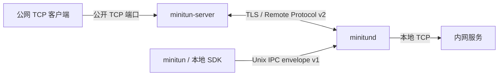

# MiniTun

[](https://github.com/LMTINSUZHOU/MiniTUN/actions/workflows/ci.yml)
[](https://github.com/LMTINSUZHOU/MiniTUN/actions/workflows/sanitizers.yml)
[](https://github.com/LMTINSUZHOU/MiniTUN/actions/workflows/package.yml)
[](LICENSE)

> 面向 Linux 团队自托管的安全 TCP 反向隧道。

> **发布状态：** v1.0.0 仍处于发布候选准备阶段，尚未发布 GA。只有完成绑定同一提交的
> 三轮性能门禁、`rc.1`、`rc.2`、24 小时满负载与随后 7 天混合负载浸泡后，才会创建
> `v1.0.0` 标签和发布物；当前源码与文档描述的是冻结目标表面。

MiniTun 将公网服务器上的 TCP 端口转发到内网主机的本地服务。v1.0 由公网服务端
`minitun-server`、客户端守护进程 `minitund`、本地 CLI `minitun`，以及稳定的
`libminitun-client.so.1` 控制 SDK 组成。

v1 只支持 Linux/systemd 与 TCP 反向隧道，不提供 UDP、P2P、SOCKS5、GUI 或远程协议
SDK。Remote Protocol v2 与 v0.4.x 不兼容；升级前请阅读
[迁移指南](docs/migration-v1.md)。

## 核心能力

- 每个 daemon 拥有稳定 `client_id`；公网 server 按客户端配置独立 PSK、可选证书
  SAN/SHA-256 绑定、公开端口 ACL，以及 tunnel/connection/idle Worker 配额。
- generation、request ID 与 `config_revision` 三重校验保证乱序、重复响应、超时和断线
  后的隧道状态确定性收敛；修改公开端口会先撤销旧 listener。
- 完整的 server/tunnel 创建、更新、启用、禁用、logout、删除命令，以及严格 JSON 的
  `config export/plan/apply`。默认 apply 不删除；`--prune` 也只删除 apply 管理的资源。
- schema v4 自动迁移 v0.4.1 数据，保留稳定 ID、名称、端点、隧道与原凭据引用。
- client/server 均可启用 `/healthz`、`/readyz`、`/metrics`；指标标签有界，审计日志不
  记录 PSK、证书内容、认证摘要或用户流量。
- C11 ABI 与 C++20 RAII SDK，可通过 `MiniTun::Client` 或 `pkg-config minitun-client`
  链接；SOVERSION 为 1。
- DEB/RPM 分离为 client、server、SDK runtime、SDK development；同时发布多架构 OCI、
  SPDX/CycloneDX SBOM、SHA-256、keyless 签名与 provenance attestation。

## 工作原理



公网 server 只知道 `client_id`、`tunnel_id` 和公开绑定，不知道本地目标地址。当前数据面
保持“一条 relay 对应一条 TLS Worker”；只有正式三轮性能门禁失败时，才会按发布规则
启用 v2 的 `multiplexed_streams` 能力。

## 快速部署

### 1. 安装

从 [GitHub Releases](https://github.com/LMTINSUZHOU/MiniTUN/releases) 下载目标架构的
软件包、`SHA256SUMS` 和 `.sigstore.json` bundle，并先验证校验和与签名。发布矩阵：

| 格式 | 架构 |
| --- | --- |
| DEB | `amd64`、`arm64`、`armhf`、`riscv64` |
| RPM | `x86_64`、`aarch64`、`armv7hl`、`riscv64` |
| OCI | `linux/amd64`、`linux/arm64`、`linux/arm/v7`、`linux/riscv64` |

Debian/Ubuntu 示例：

```bash
sudo apt install ./minitun-server_1.0.0_amd64.deb
sudo apt install ./minitun-client_1.0.0_amd64.deb
# 开发 SDK 可选
sudo apt install ./libminitun-client1_1.0.0_amd64.deb \
  ./libminitun-client-dev_1.0.0_amd64.deb
```

RPM 系统安装对应的 `minitun-server`、`minitun-client`、`libminitun-client1` 和
`libminitun-client-devel` 包。软件包创建专用账户，但不会生成凭据或自动启动服务。

### 2. 配置公网 server

先取得客户端稳定身份：

```bash
sudo systemctl enable --now minitund.service
minitun daemon identity --json
```

为该 `client_id` 生成独立 PSK，并创建严格 JSON 策略。策略与 PSK 都必须由
`minitun-server` 服务账户拥有；PSK 不得对组或其他用户开放：

```bash
umask 077
openssl rand -hex 32 >team-a.psk
sudo install -d -m 0750 -o minitun-server -g minitun-server \
  /etc/minitun-server/clients
sudo install -m 0600 -o minitun-server -g minitun-server team-a.psk \
  /etc/minitun-server/clients/team-a.psk
sudo install -m 0640 -o minitun-server -g minitun-server clients.json \
  /etc/minitun-server/clients.json
sudo install -m 0644 server.crt /etc/minitun-server/server.crt
sudo install -m 0600 -o minitun-server -g minitun-server server.key \
  /etc/minitun-server/server.key
```

最小策略：

```json
{
  "format_version": 1,
  "clients": [
    {
      "client_id": "client_0123456789abcdef0123456789abcdef",
      "enabled": true,
      "psk_file": "/etc/minitun-server/clients/team-a.psk",
      "allowed_ports": ["6000-6099"],
      "max_tunnels": 100,
      "max_connections": 1000,
      "max_idle_workers": 32
    }
  ]
}
```

`certificate_san` 或 `certificate_sha256` 可额外绑定客户端证书；启用时还必须配置
`--client-ca`，PSK 仍然必需。完整字段见[配置文档](docs/configuration.md)。

启动 server：

```bash
sudo systemctl enable --now minitun-server.service
systemctl status minitun-server.service
```

默认控制端口为 `2333/tcp`。云安全组和主机防火墙还必须仅放行策略允许、实际使用的
公开 tunnel 端口。

### 3. 配置 daemon 与隧道

以下配置把公网 `6000` 转发到 daemon 主机的 `127.0.0.1:8080`：

```bash
minitun server add tunnel.example.com:2333 --name edge
minitun server login edge                  # 无回显读取 PSK
minitun tun add edge 8080 6000 --name web
minitun tun inspect web --json
```

管道输入使用主选项 `--psk-stdin`；`--token-stdin` 仅作为 v0.4.x CLI 迁移别名：

```bash
minitun server login edge --psk-stdin </secure/path/team-a.psk
```

当 tunnel 的 `actual_state` 为 `active` 后即可访问公开端口。同步是异步的；持续
`pending` 或 `failed` 时检查 `server_actual_state`、`pending_reason`、`last_error` 和
双方审计日志。

### 4. 生命周期与声明式配置

```bash
minitun server update edge --endpoint tunnel2.example.com:2333 \
  --tls-server-name tunnel2.example.com --ca-file organization-ca.pem
minitun server disable edge
minitun server enable edge
minitun server logout edge

minitun tun update web --local-port 8081 --server-port 6001
minitun tun disable web
minitun tun enable web

minitun config export
minitun config plan /etc/minitun/config.json
minitun config apply /etc/minitun/config.json
minitun config apply /etc/minitun/config.json --prune
```

disable 保留记录；enable 会自动恢复期望状态。tunnel 的稳定 ID 与所属 server 不可更新。
相同配置重复 apply 为零动作，不重建 session。

## 运维端点

管理 HTTP 端点默认关闭。回环监听可不认证：

```bash
minitund --admin-listen 127.0.0.1:9091 ...
minitun-server --admin-listen 127.0.0.1:9090 ...
curl --fail http://127.0.0.1:9090/readyz
curl --fail http://127.0.0.1:9090/metrics
```

非回环监听必须同时提供 `--admin-token-file`，并且只应位于可信网络或 TLS 反向代理
之后。详情见[运维文档](docs/operations.md)。

## 默认路径

| 路径 | 用途 |
| --- | --- |
| `/run/minitun/minitun.sock` | CLI/SDK 与 daemon 的 Unix IPC |
| `/var/lib/minitun/state.db` | schema v4 资源状态与稳定身份 |
| `/var/lib/minitun/credentials.db` | daemon 私有凭据库 |
| `/etc/minitun-server/server.crt` | server TLS 证书链 |
| `/etc/minitun-server/server.key` | server TLS 私钥 |
| `/etc/minitun-server/clients.json` | 每客户端策略 |

## 文档

- [CLI](docs/cli.md)
- [配置与客户端策略](docs/configuration.md)
- [系统架构](docs/architecture.md)
- [Remote Protocol v2](docs/protocol.md)
- [本地控制 SDK](docs/sdk.md)
- [运维与可观测性](docs/operations.md)
- [v0.4.1 → v1.0 迁移](docs/migration-v1.md)
- [性能与浸泡门禁](docs/performance.md)
- [开发、测试与发布](docs/development.md)
- [变更日志](docs/changelog.md)

## 许可证

MiniTun 使用 [MIT License](LICENSE)。
