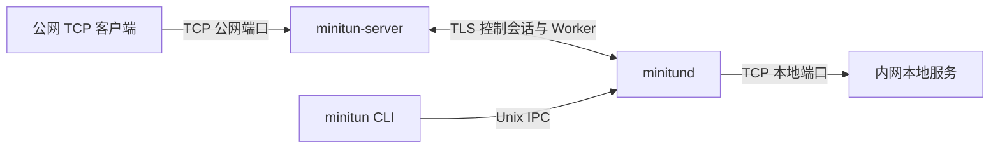

# MiniTun

[](https://github.com/LMTINSUZHOU/MiniTUN/actions/workflows/ci.yml)
[](https://github.com/LMTINSUZHOU/MiniTUN/actions/workflows/sanitizers.yml)
[](https://github.com/LMTINSUZHOU/MiniTUN/actions/workflows/package.yml)
[](LICENSE)

> 轻量、安全、面向 Linux 的 TCP 反向隧道。

MiniTun 使用 C++20 开发，可将公网服务器上的 TCP 端口转发到内网主机中的本地服务。
它由公网服务端 `minitun-server`、客户端守护进程 `minitund` 和命令行工具 `minitun`
组成，适合以 systemd 或 OpenWrt procd 服务长期运行。

[特性](#特性) · [工作原理](#工作原理) · [生产部署](#生产部署) ·
[常用命令](#常用命令) · [文档](#文档)

## 特性

- **多服务端连接**：一个客户端守护进程可同时连接多个公网服务器，会话、隧道与
  Worker Pool 相互隔离。
- **传输与认证**：远程连接使用 TLS 1.2 或更高版本，并通过 HMAC-SHA256 质询完成
  Token 认证，包含主机名校验、重放防护、时钟偏差检查与认证限速。
- **持久化控制面**：服务器、隧道和客户端身份保存在 SQLite 中；服务重启后会自动
  恢复连接与隧道状态。
- **安全的本地管理**：CLI 仅通过受权限保护的 Unix 套接字访问守护进程；Token
  独立保存在权限为 `0600` 的凭据数据库中，不进入普通日志或命令参数。
- **有界资源使用**：连接、隧道、Worker、帧大小、等待时间和并发任务均有明确上限；
  TCP 中继采用固定 16 KiB 双向缓冲和写入背压。
- **稳定的连接生命周期**：支持心跳、指数退避重连、TCP 半关闭、空闲超时、会话代次
  隔离和有期限的优雅退出。
- **生产运维工具**：提供本地 `health`、`readiness`、`metrics`、`reload` 与
  `doctor` 命令，支持健康探测、运行指标、热加载、SQLite 在线备份和诊断。
- **多平台交付**：提供独立 Client/Server DEB 与 RPM，以及集成
  UCI 和 procd 的 OpenWrt APK；OpenWrt 产物覆盖 x86_64、ARM、MIPS 与 RISC-V。
- **持续验证**：CI 覆盖 GCC、Clang、完整 CTest、ASan、UBSan、TSan、libFuzzer，
  DEB/RPM 的干净容器安装测试，以及 OpenWrt 多架构交叉编译与 QEMU 运行验证；
  AArch64 额外覆盖 TLS、SQLite 和真实 TCP 隧道端到端测试。

## 工作原理



| 组件 | 部署位置 | 职责 |
| --- | --- | --- |
| `minitun-server` | 具有公网地址的 Linux 服务器 | 接受客户端会话并监听对外暴露的 TCP 端口 |
| `minitund` | 能访问本地服务的内网 Linux 主机 | 保存配置、维护会话与 Worker、连接本地目标 |
| `minitun` | 与 `minitund` 同一主机 | 通过 Unix 套接字管理服务器和隧道 |

公网服务端只接收隧道标识和公网绑定信息，不接收本地目标地址。每个活动连接由独立的
TLS Worker 承载。

## 生产部署

部署前请准备一台公网服务器、一台可以访问目标服务的内网主机、
服务端域名与有效 TLS 证书，并确定实际需要对外开放的 TCP 端口。

| 软件包 | 运行环境 | 发布架构 |
| --- | --- | --- |
| DEB | Debian/Ubuntu | `amd64`、`arm64`、`armhf`、`riscv64` |
| RPM | Fedora/RHEL 系 | `x86_64`、`aarch64`、`armv7hl`、`riscv64` |
| IPK | OpenWrt 24.10（opkg） | `x86_64`、`aarch64_generic`、`arm_cortex-a15_neon-vfpv4`、`mips_24kc`、`mipsel_24kc`、`riscv64_generic` |
| APK | OpenWrt 25.12（apk） | `x86_64`、`aarch64_generic`、`arm_cortex-a15_neon-vfpv4`、`mips_24kc`、`mipsel_24kc`、`riscv64_generic` |

### 1. 获取并安装软件包

从 [Releases](https://github.com/LMTINSUZHOU/MiniTUN/releases) 下载对应版本的软件包
和 `SHA256SUMS`。如果目标版本尚未发布，请按[开发文档](docs/development.md)在受信任的
构建环境中生成并验证软件包。

```bash
sha256sum --ignore-missing --check SHA256SUMS
```

Debian/Ubuntu：

```bash
# 公网服务器；以下示例为 amd64，其他架构替换文件名中的 amd64 为
# arm64 / armhf / riscv64
sudo apt install ./minitun-server-0.3.1-linux-amd64.deb

# 内网客户端
sudo apt install ./minitun-client-0.3.1-linux-amd64.deb
```

Fedora/RHEL 系：

```bash
# 公网服务器；以下示例为 x86_64，其他架构替换文件名中的 x86_64 为
# aarch64 / armv7hl / riscv64
sudo dnf install ./minitun-server-0.3.1-linux-x86_64.rpm

# 内网客户端
sudo dnf install ./minitun-client-0.3.1-linux-x86_64.rpm
```

OpenWrt 的推荐安装方式是添加 MiniTun 签名软件源，无需 `--allow-untrusted`。
软件源与公钥托管在 GitHub Pages（`https://lmtinsuzhou.github.io/MiniTUN/`），
仓库结构镜像官方 OpenWrt 布局：`openwrt/<版本>/<target>/<subtarget>/packages/`。
请将下面的 `<target>/<subtarget>` 替换为设备对应的目标（例如 `x86/64`、
`armsr/armv8`、`armsr/armv7`、`ath79/generic`、`ramips/mt7621`、
`sifiveu/generic`），`<key-id>` 为 16 位十六进制密钥 ID（即软件源目录中公钥文件的
文件名，见仓库根目录 `README.txt`）。

OpenWrt 24.10（opkg）：

```sh
opkg print-architecture

# 安装签名公钥（文件名必须保持为密钥 ID）
wget -O /etc/opkg/keys/<key-id> \
  https://lmtinsuzhou.github.io/MiniTUN/openwrt/24.10.8/<target>/<subtarget>/packages/<key-id>

# 添加签名软件源
echo 'src/gz minitun https://lmtinsuzhou.github.io/MiniTUN/openwrt/24.10.8/<target>/<subtarget>/packages' \
  >> /etc/opkg/customfeeds.conf

opkg update
opkg install minitun-server   # 或 minitun-client
```

OpenWrt 25.12（apk v3）：

```sh
apk --print-arch

# 安装签名公钥
wget -O /etc/apk/keys/minitun-build.pem \
  https://lmtinsuzhou.github.io/MiniTUN/openwrt/25.12.5/<target>/<subtarget>/packages/minitun-build.pem

# 添加软件源并安装（依赖会自动从官方 OpenWrt 软件源解析）
apk add --repository \
  https://lmtinsuzhou.github.io/MiniTUN/openwrt/25.12.5/<target>/<subtarget>/packages \
  minitun-server   # 或 minitun-client
```

密钥轮换时，新版本会使用新密钥；请同时移除
`/etc/opkg/keys/<旧 key-id>` 与 `/etc/apk/keys/minitun-build.pem`。

也可以绕过软件源，直接安装 GitHub Release 中的独立产物。此时无法自动验证签名，
必须先校验 `SHA256SUMS`：25.12 的 APK 本地安装仍需 `--allow-untrusted`，
24.10 的 IPK 使用 `opkg install <文件>`：

```sh
grep 'minitun-server-0.3.1-openwrt-25.12.5-aarch64_generic.apk$' \
  SHA256SUMS | sha256sum -c -
apk add --allow-untrusted \
  ./minitun-server-0.3.1-openwrt-25.12.5-aarch64_generic.apk

grep 'minitun-server-0.3.1-openwrt-24.10.8-aarch64_generic.ipk$' \
  SHA256SUMS | sha256sum -c -
opkg install ./minitun-server-0.3.1-openwrt-24.10.8-aarch64_generic.ipk
```

所有软件包都会创建专用服务账户，但不会生成凭据，也不会自动启动服务。

### 容器镜像（OCI）

Release 同时发布最小 OCI 镜像（`ghcr.io/lmtinsuzhou/minitun-server` 与
`ghcr.io/lmtinsuzhou/minitun-client`），多架构清单覆盖 `linux/amd64`、
`linux/arm64`、`linux/arm/v7` 与 `linux/riscv64`。镜像以非 root 用户
（UID 65532）运行，客户端镜像内置系统 CA 信任库。

```bash
# 公网服务端：挂载证书、私钥与 Token
docker run -d --name minitun-server \
  -v /etc/minitun-server:/etc/minitun-server:ro \
  -p 2333:2333 \
  ghcr.io/lmtinsuzhou/minitun-server:0.3.1

# 内网客户端：挂载状态卷（state.db 与 credentials.db）
docker run -d --name minitund \
  -v minitun-state:/var/lib/minitun \
  ghcr.io/lmtinsuzhou/minitun-client:0.3.1
```

需要覆盖默认路径或参数时，在镜像名后追加命令行参数（例如
`ghcr.io/lmtinsuzhou/minitun-server:0.3.1 --listen 0.0.0.0:4433`）。

### 2. 配置公网服务端

为公网服务器准备完整证书链、匹配的 PEM 私钥和随机 Token。证书的 SAN 必须包含
客户端连接时使用的域名。

DEB/RPM 主机：

```bash
umask 077
openssl rand -hex 32 >token

sudo install -d -m 0750 -o root -g minitun-server /etc/minitun-server
sudo install -m 0644 server.crt /etc/minitun-server/server.crt
sudo install -m 0600 -o minitun-server -g minitun-server \
  server.key /etc/minitun-server/server.key
sudo install -m 0600 -o minitun-server -g minitun-server \
  token /etc/minitun-server/token
```

OpenWrt 主机：

```sh
mkdir -p /etc/minitun-server
cp server.crt server.key token /etc/minitun-server/
chown root:root /etc/minitun-server/server.crt
chown minitun-server:minitun-server \
  /etc/minitun-server/server.key /etc/minitun-server/token
chmod 0644 /etc/minitun-server/server.crt
chmod 0600 /etc/minitun-server/server.key /etc/minitun-server/token
```

默认服务监听控制端口 `0.0.0.0:2333`，不额外限制隧道端口，应用层允许全部有效 TCP
端口 `1-65535`。请在云安全组与主机防火墙中仅开放实际需要的端口。DEB/RPM
部署如需设置端口白名单或修改监听地址，请创建 systemd override：

```bash
sudo systemctl edit minitun-server.service
```

```ini
[Service]
ExecStart=
ExecStart=/usr/bin/minitun-server --foreground --listen 0.0.0.0:4433 --allow-ports 10000-10999 --tls-cert /etc/minitun-server/server.crt --tls-key /etc/minitun-server/server.key --token-file /etc/minitun-server/token
```

DEB/RPM 主机启动并检查服务：

```bash
sudo systemctl enable --now minitun-server.service
systemctl status minitun-server.service
journalctl -u minitun-server.service -n 50 --no-pager
```

OpenWrt 通过 UCI 启用 procd 服务：

```sh
uci set minitun-server.main.enabled='1'
uci commit minitun-server
/etc/init.d/minitun-server enable
/etc/init.d/minitun-server start
logread -e minitun-server
```

OpenWrt 默认配置也不设置端口白名单。如需限制，执行
`uci set minitun-server.main.allow_ports='10000-10999'` 并提交、重启服务。
官方 DEB、RPM 与 OpenWrt 服务仅授予 `CAP_NET_BIND_SERVICE`，因此专用非 root
账户也可按配置绑定 `1-65535`。直接运行自行编译的二进制时，低于 `1024` 的端口仍需
由管理员显式授予该能力。

### 3. 启动客户端守护进程

`minitund` 默认使用系统 CA 信任库验证服务端证书。使用私有 CA 时，应先将 CA 证书
安装到内网主机的系统信任库。

DEB/RPM 主机：

```bash
sudo systemctl enable --now minitund.service
sudo usermod -aG minitun "$USER"
```

重新登录以刷新用户组，然后检查本地控制面：

```bash
minitun daemon status
minitun version
```

OpenWrt 上通常以 `root` 运行管理命令：

```sh
uci set minitun.main.enabled='1'
uci commit minitun
/etc/init.d/minitun enable
/etc/init.d/minitun start
minitun daemon status
logread -e minitun
```

### 4. 创建隧道

以下示例将公网服务器的 `6000` 端口转发到内网主机的 `127.0.0.1:8080`：

```bash
minitun server add tunnel.example.com:2333 --name primary
minitun server login primary
minitun tun add primary 8080 6000 --name web
minitun tun inspect web --json
```

`server login` 会在终端中无回显地读取 Token。隧道同步是异步的；当
`actual_state` 变为 `active` 后，即可访问：

```bash
curl http://tunnel.example.com:6000/
```

如果隧道持续为 `pending`，检查 `tun inspect --json` 返回的
`server_actual_state`、`pending_reason` 与 `last_error`；`last_synced_at` 表示最近一次
收到远端注册或注销结果的 Unix 毫秒时间戳。`2333/tcp` 只承载控制和 Worker 连接；
云安全组与主机防火墙还必须放行实际的公网映射端口（本例为 `6000/tcp`）。TLS SAN、CA、Token
或系统时间异常会记录在服务器与隧道的 `last_error` 中。

本地目标不在回环地址时，使用 `--local-host`：

```bash
minitun tun add primary 8080 6001 \
  --local-host 192.168.1.20 \
  --name nas-web
```

### 默认路径

| 路径 | 用途 |
| --- | --- |
| `/run/minitun/minitun.sock` | CLI 与客户端守护进程之间的 Unix 套接字 |
| `/var/lib/minitun/state.db` | DEB/RPM 的服务器、隧道与客户端身份 |
| `/var/lib/minitun/credentials.db` | DEB/RPM 的客户端凭据存储 |
| `/etc/minitun/state.db` | OpenWrt 的服务器、隧道与客户端身份 |
| `/etc/minitun/credentials.db` | OpenWrt 的客户端凭据存储 |
| `/etc/minitun-server/server.crt` | 服务端证书链 |
| `/etc/minitun-server/server.key` | 服务端私钥 |
| `/etc/minitun-server/token` | 服务端认证 Token |

升级和普通卸载会保留 `/var/lib/minitun` 与 `/var/lib/minitun-server`。Debian purge
会删除状态目录；RPM 卸载会保留状态。OpenWrt 的 UCI 配置属于 conffile，
本地修改在升级时保留。无论使用哪种包格式，升级、回滚或卸载前都应备份状态目录
与管理员提供的凭据。

## 常用命令

```bash
minitun status
minitun health
minitun readiness
minitun metrics
minitun doctor --json --checkpoint
minitun reload
minitun server list
minitun server inspect primary --json
minitun tun list primary
minitun tun inspect web --json
minitun tun remove web
minitun server remove primary
```

完整命令、JSON 输出与退出码见 [CLI 文档](docs/cli.md)。也可使用系统 man 手册：

```bash
man minitun
man minitund
man minitun-server
```

## 文档

- [CLI 文档](docs/cli.md)：命令、Token 输入、隧道语义与退出码。
- [系统架构](docs/architecture.md)：组件、持久化、会话、Worker 与中继生命周期。
- [远程协议](docs/protocol.md)：帧格式、认证、隧道注册与数据中继。
- [开发文档](docs/development.md)：源码构建、本地演示、测试、打包、发布与排障。
- [变更日志](CHANGELOG.md)：版本变更记录。

## 许可证

MiniTun 使用 [MIT License](LICENSE)。
