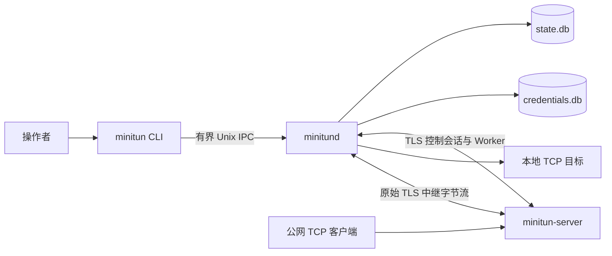

# 系统架构

MiniTun 由三个 Linux 程序组成：

- `minitun`：无状态、短生命周期的 CLI，只与本地守护进程通信；
- `minitund`：客户端守护进程，负责持久化、凭据、服务器会话、隧道状态和本地中继连接；
- `minitun-server`：公网 TLS 端点和远程 TCP 监听器管理器。

每个已配置的公网服务端都有隔离的 `ServerSession`，包括独立的控制连接、认证状态、
心跳、重连控制器、Worker Pool、会话代次和隧道注册表。一个会话发生故障不得影响
其他会话。

## 组件与数据流



控制面与数据面彼此分离。CLI 不接触数据库或公网服务端；公网服务端也不知道本地目标
地址。只有 `minitund` 能将经过认证的 `tunnel_id` 解析为本地持久化端点。

## 存储层

公共层提供共享的错误/结果模型、结构化日志、经过校验的端点与端口范围、强类型随机
ID、时间辅助函数和可移动但不可复制的秘密存储。`MiniTun::storage` 仅链接到
`minitund` 和存储测试；CLI 与公网服务端均不链接 SQLite。

`StateRepository` 持有一个已经迁移的 `Database`，并公开 `ServerRepository` 和
`TunnelRepository`。只有守护进程可以打开或写入状态数据库。CLI 命令通过 IPC
请求守护进程执行全部查询与修改。

### SQLite 模式版本 2

默认路径为 `/var/lib/minitun/state.db`。版本 2 包含：

- `schema_version`：以 `version` 为主键，`applied_at` 为非负 Unix 毫秒时间戳。
  迁移历史必须非空、连续，且版本不得高于当前二进制支持的版本；
- `servers`：`id`、唯一且可空的 `name`、规范化 `endpoint`、可空
  `credential_ref`、可空 `remote_server_id`、期望状态与实际状态、可空的最后错误码
  和错误消息、重连次数、可空延迟以及创建/更新时间戳；
- `tunnels`：`id`、可空且非唯一的 `name`、`server_id`、TCP 协议、本地和远程
  主机/端口对、期望状态与实际状态、可空的最后错误码和错误消息以及创建/更新时间戳；
- `daemon_identity`：一条受约束记录，保存所有远程服务端会话共用的稳定 `client_`
  身份。首次启动守护进程时以事务方式创建，重启后继续保留。

ID、文本字节长度、状态值、TCP 端口、计数器、延迟和时间戳均有数据库约束；仓库记录
跨越 C++ 边界时还会再次校验。时间戳使用 Unix 毫秒。隧道通过
`ON DELETE CASCADE` 引用 `servers(id)`。远程监听器唯一键为
`(server_id, protocol, remote_host, remote_port)`，因此不同服务器可以使用相同的
远程端点。状态同步索引如下：

```text
idx_servers_reconcile(desired_state, id)
idx_tunnels_reconcile(server_id, desired_state, id)
idx_tunnels_name(name) WHERE name IS NOT NULL
```

默认进程内上限为 128 条服务器记录和 4096 条隧道记录。测试及未来守护进程配置可
注入其他限制。

每个打开的连接都要求并验证以下设置：

```sql
PRAGMA journal_mode = WAL;
PRAGMA foreign_keys = ON;
PRAGMA synchronous = NORMAL;
PRAGMA busy_timeout = 5000;
PRAGMA wal_autocheckpoint = 1000;
PRAGMA journal_size_limit = 16777216;
```

只有迁移和模式校验成功后才启用 WAL。版本 1 创建过程在 `BEGIN IMMEDIATE` 事务中
执行。遇到更新版本、畸形迁移历史、模式定义漂移、意外的用户模式对象、完整性或
外键违规，或者不含 `schema_version` 的非空数据库时，系统会拒绝启动。失败会回滚
迁移；MiniTun 不会删除或重建用户数据库。

### 仓库与事务

两个仓库都提供经过校验的创建、查找、确定性列表、更新、墓碑和物理删除操作。服务器
名称唯一；隧道名称有意允许重复，因此名称匹配多条记录时查询会因歧义失败。将服务器
标记为删除也会标记其子隧道；只有服务器及全部子项都成为删除墓碑后，物理删除才会
级联。创建时间戳不可变，任何使记录时间戳倒退的更新都会被拒绝。

每个独立修改都拥有一个事务。接受共享 `Transaction` 的重载允许服务器和隧道修改
原子提交。事务作用于单个连接并绑定线程，使用 `BEGIN IMMEDIATE`，拒绝嵌套，在
整个生命周期持有连接锁；事务被放弃或参与的仓库操作失败时会回滚。事务不得跨越
网络或异步工作。

### 重启状态恢复

`StateRepository::recover()` 在一个事务中完成归一化和快照加载：

| 已持久化期望状态 | 凭据引用 | 恢复后的实际状态 |
| --- | --- | --- |
| 服务器 `enabled` | 不存在 | `not_authenticated` |
| 服务器 `enabled` | 存在 | `disconnected` |
| 服务器 `disabled` 或 `removed` | 任意 | `disabled` |
| 隧道 `active` | 不适用 | `pending` |
| 隧道 `disabled` | 不适用 | `disabled` |
| 隧道 `removed` | 不适用 | `removing` |

服务器重连次数重置为零，延迟重置为空。已删除服务器会把 `removed`/`removing`
墓碑状态传播给每条子隧道。该操作是幂等的，并且只在全部更新成功后返回经过完整校验
的服务器/隧道快照。

`minitund` 在接受 IPC 前调用恢复，然后根据独立凭据存储校验每个活动的
`credential_ref`。秘密缺失时会清除引用并恢复为 `not_authenticated`；已删除
服务器的凭据会被删除。

## 本地 IPC

`MiniTun::ipc` 与 SQLite 相互独立。CLI 链接公共库和 IPC 库，只有守护进程链接
存储库。每条线消息采用以下有界格式：

```text
uint32 网络字节序 JSON 字节长度 | UTF-8 JSON 负载
```

请求与响应使用协议版本 1 和规范的 `req_` 标识符。请求模式严格要求 `version`、
`request_id`、`method` 和对象类型的 `params`。响应要么携带对象类型的 `result`，
要么携带稳定的公共错误码和不敏感消息。未知顶层字段、畸形 UTF-8、不支持的版本、
无效 ID、非对象参数和超过 1 MiB 的消息都会在分派前被拒绝。

分派器具有线程安全的方法注册表。处理器失败会转换为协议错误响应；未捕获的处理器
异常会被隔离并转换为通用 `internal_error`，且不暴露异常文本。单个
`ControlService` 注册全部本地控制方法。

`LocalServer` 接受多个 Unix 域套接字会话，限制会话总数，并为每个连接只处理一个
请求。每个会话增量解码输入并拥有独立故障边界，因此畸形客户端无法终止接受循环或
其他会话。处理器运行在有界的四线程分派池中；从首次读取到响应写入，每请求绝对期限
始终生效，因此慢处理器无法阻塞套接字 I/O 或无限期占用会话。线程池关闭时先停止
接收任务，再等待已接受任务完成。`LocalClient` 分别限制连接阶段和请求阶段。

服务端以 `0660` 模式创建套接字；所有者必须是守护进程的有效用户，也可以配置获
授权组。父目录必须真实存在且归守护进程所有；目录链中拒绝符号链接，只有在 sticky
目录语义保护条目时才允许可写祖先目录。由守护进程所有、模式为 `0600` 的伴随锁
文件串行化陈旧路径替换，并保持锁定直至套接字清理完成。启动时拒绝符号链接和非
套接字冲突，在替换自有的陈旧套接字前先探测，并且只删除自己创建的同一 inode。
生产路径为 `/run/minitun/minitun.sock`。已安装的 systemd unit 或 OpenWrt procd
服务会创建受保护的 `minitun:minitun` 运行时目录，并以该账户运行服务。

## 本地控制面

`MiniTun::daemon` 持有 IPC 控制处理器，同时依赖存储和 IPC。CLI 继续只链接公共库
与 IPC，因此无法绕过守护进程授权或数据库生命周期规则。注册的方法如下：

```text
daemon.status
status
server.add  server.login  server.list  server.inspect  server.remove
tun.add     tun.list      tun.inspect  tun.remove
```

控制处理器严格拒绝缺失、类型错误、越界和未知参数。复合读取与隧道创建使用共享状态
事务，因此并发 CLI 请求看到一致的服务器/隧道关系。删除操作使用仓库墓碑 API；
公开列表/详情结果会过滤墓碑。即使服务器断开连接，隧道仍持久化为
`active/pending`。

凭据后端是独立 SQLite 数据库（DEB/RPM 默认位于
`/var/lib/minitun/credentials.db`，OpenWrt 默认位于 `/etc/minitun/credentials.db`）。它通过
`CredentialStore` 接口保存不透明键/二进制值对，强制要求由守护进程所有且模式为
`0600` 的普通文件，使用绑定参数和事务更新，启用 SQLite 安全删除，并拒绝不支持
或没有版本信息的非空模式。状态数据库只保存不透明键。Token 不会出现在响应、错误
或日志中。

含 Token 的 IPC 缓冲区会在序列化、传输、解析和分派后主动清除。`SecureString`
仍是凭据边界使用的可移动但不可复制表示。文件权限和内存清除可以降低暴露风险，但
不会把凭据数据库变成加密保险库；文件系统与主机信任仍然是安全前提。

## 远程协议与认证

远程协议库提供显式的 24 字节网络字节序头、64 KiB 帧上限、增量解码、有界负载
字段以及独立的控制/Worker 连接状态机。公网服务端接受 TLS 1.2 或更高版本的控制
连接，执行 HMAC 质询认证，为每个认证会话分配新代次，并强制执行心跳期限。线协议
详情见[远程协议](protocol.md)。

## 多服务器会话

`ServerManager` 定期同步已启用且已配置凭据的服务器记录，并为每个服务器 ID 持有
一个独立 `ServerSession`。每个会话都有自己的 strand、解析器、TLS 上下文与控制流、
操作定时器、心跳状态、会话代次和带抖动的指数退避重连控制器。独立 TLS 上下文避免
不同服务器的并发握手共享证书验证缓存。认证失败只会使对应服务器停留在
`not_authenticated`；网络和心跳失败会进入有界退避。修改凭据或删除服务器只会
替换受影响的会话。

开始远程工作前，守护进程从模式版本 2 加载一个稳定的 `client_id`。默认使用主机名
校验和 SNI，支持平台信任库或显式 `--tls-ca`，固定 `--io-threads` 范围为 1..16。
仅供开发使用的 `--insecure-skip-verify` 会输出显著警告。隧道注册与 Worker Pool
建立在这些隔离的会话生命周期之上。

## 隧道状态同步

每个在线客户端会话在心跳处理期间比较持久化隧道期望状态与内存注册集合。缺失的活动
隧道从 `registering` 转为 `active`；服务端策略或绑定失败只会使该隧道转为
`failed` 并记录稳定错误码，之后的同步会重试。已删除或禁用的隧道会被幂等注销。
会话断开时清除运行时集合，并把活动隧道恢复为 `pending`，使新代次能在服务端或
守护进程重启后重新创建所有监听器。

公网服务端在其 Asio strand 上持有 `TunnelRegistry`。监听器键包含已认证的
`client_id` 和 `tunnel_id`，所有权还记录当前会话代次。确认注册前会检查数值地址
解析、`--allow-ports`、逐客户端数量以及操作系统绑定错误。

## Worker Pool

每个守护进程 `ServerSession` 都拥有独立的客户端 Worker Pool，仅共享一个有界全局
Worker 预算。Worker 独立连接并校验 TLS，携带当前 `client_id` 和
`session_generation`，被消耗或断开后自动补充。服务端空闲容量同时受会话级和全局
上限约束；清理陈旧代次时会立即关闭底层 TLS 连接。公网套接字等待匹配 Worker 最长
两秒；空闲 Worker 默认 60 秒后过期。

## TCP 中继

已分配的客户端 Worker 在本地 SQLite 中查找活动隧道，并只异步连接该持久化端点。
`LOCAL_CONNECT_OK` 使双方切换为原始 TLS 应用字节。共享中继操作在每个方向使用一个
固定 16 KiB 数组，绝不排队无界写入，并记录双向字节数和持续时间。EOF 会传播为
发送侧关闭，同时保留反向流量。连接重置、broken pipe、EOF 和取消视为普通断开；
非预期 I/O 失败及有界空闲超时会取消两个套接字。

## 稳定性与关闭

公网服务端在其 Asio strand 上跟踪已接受的 TLS 会话和待处理公网套接字。收到
`SIGINT` 或 `SIGTERM` 后，先停止控制监听器和隧道监听器、拒绝新的中继预留，向
已认证控制对端尽力发送 `GOAWAY`，并最多在 `--shutdown-timeout` 内保留活动中继；
期限到达后取消所有剩余套接字。守护进程遵循相同的前台生命周期：停止 IPC 和状态
同步、向在线控制会话发送 `GOAWAY`、关闭空闲 Worker，并允许已消耗 Worker 在配置
期限内排空。任何信号回调都不会从所属 strand 之外修改会话注册表。

公网中继从接受连接直至中继拆除始终持有一个可移动但不可复制的配额租约。因此
`--max-connections-per-client` 和 `--max-total-connections` 同时覆盖有界 Worker
等待与活动数据路径，并在每条失败或关闭路径上恰好恢复一次容量。守护进程另行将
`--max-total-connections` 应用于所有独立服务器池中的空闲与已消耗 Worker 会话。

## 系统边界与非目标

- MiniTun 只提供 TCP 反向隧道，不实现 UDP 转发；
- 不实现 P2P、NAT 穿透、SOCKS5 代理或通用端口转发协议；
- 每条活动中继使用独立 TLS Worker 连接，不在单连接中复用多条数据流；
- 生产服务管理、账户和软件包布局面向 Linux systemd 与 OpenWrt procd；
- 管理员负责 CA、证书、私钥、Token、防火墙和端口白名单策略。
