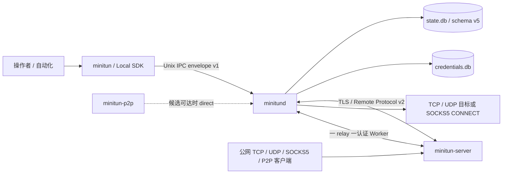

# 系统架构

当前 MiniTun 源码由六个公开交付面组成：

- `minitun-server`：公网 TLS/control listener、客户端策略、公开 tunnel listener 与 relay；
- `minitund`：本地状态、凭据、远程 session、TunnelReconciler 和本地目标连接；
- `minitun`：无状态 CLI，只通过本地 Unix IPC 调用 daemon；
- `minitun-p2p`：面向 P2P tunnel 的本地 connector，直连失败时自动使用 TLS relay；
- `libminitun-client.so.1`：与 CLI 使用同一 IPC 的稳定 C ABI/C++20 控制 SDK；
- `libminitun-remote-protocol.so.1`：独立的 Remote Protocol v2 C++20 codec、增量 decoder
  与认证摘要 helper。

MiniTun 聚焦最小资源占用：不提供 Web GUI，控制面只有 CLI 与本地 SDK。



CLI 与 SDK 不直接打开数据库；server 不知道本地目标地址。只有 daemon 能把认证后的
`tunnel_id` 解析为本地端点。

## 模块边界

共享模块按职责拆分：

| 模块 | 责任 |
| --- | --- |
| `common` | 有界 ID/endpoint/port range、错误、日志、秘密内存、版本、failpoint |
| `protocol` | v2 帧、消息、HMAC、TLS、UDP framing、SOCKS5、P2P 协商与固定缓冲 relay |
| `storage` | schema 迁移、仓库、事务、在线备份与凭据库 |
| `ipc` | envelope v1、Unix transport、dispatcher、客户端 |
| `daemon` | control service、声明式配置、server session、worker pool、reconciler |
| `server` | 客户端策略、认证/session、tunnel registry、quota、worker pool |
| `admin` | 有界 HTTP 健康、就绪与 Prometheus 端点 |
| `sdk` | 稳定本地 C ABI/C++ wrapper，以及独立 Remote Protocol C++ API |

`server.cpp` 与 `server_manager.cpp` 仍是异步生命周期编排器；策略解析、listener 所有权、
quota、worker pool、状态收敛、声明式配置和 admin HTTP 已分别位于独立模块中。网络异步
路径不跨 `co_await` 持有数据库事务。

## schema v5 与凭据

`state.db` 的 schema v5 包含：

- `daemon_identity`：跨重启稳定的 `client_...` ID；
- `servers`：稳定 ID、可选唯一名称、endpoint、TLS server name、PSK/CA/client cert/key
  的不透明凭据引用、desired/actual state、remote server ID、重连信息、
  `config_revision` 和 `managed_by_config`；
- `tunnels`：稳定 ID、可选名称、不可变 server 归属、`tcp`/`udp`/`socks5`/`p2p`
  mode、本地 endpoint、公开 bind host/port、desired/actual state、最后同步时间、
  `config_revision` 和 `managed_by_config`；
- 连续的 `schema_version` 迁移历史和约束/索引。

打开连接后强制验证 WAL、foreign keys、同步模式、busy timeout、schema 定义、完整性和
外键。未来 schema、漂移对象、断裂迁移历史或无版本的非空数据库都会拒绝启动，不会被
自动删除或重建。

历史 schema v3 数据会先迁移到 v4；当前版本再以事务重建 tunnel 表并迁移到 v5，原有
tunnel 默认为 `tcp`、公开 bind host 默认为 `0.0.0.0`。ID、名称、endpoint、tunnel 和
原 PSK 引用保持不变。旧程序不能打开 schema v5；回滚必须恢复升级前的成对备份。

秘密位于独立 `credentials.db`，状态库只保存不透明引用。每类 server 凭据使用两个有界
轮换槽：先写非活动槽，再在状态事务中切换引用，最后清理旧槽。失败会清理暂存项；启动
恢复会删除未被任何活动记录引用的槽，并将缺失 PSK 的 server 收敛为
`not_authenticated`。logout 删除 PSK、CA、客户端证书和私钥。

数据库文件必须是 daemon 所有、模式 `0600` 的普通文件。内存和 IPC buffer 在秘密使用
后主动清除，但本机文件系统与服务账户仍属于信任边界。

## 本地 IPC 与控制面

IPC envelope 保持版本 1：

```text
uint32 网络字节序 JSON 长度 | UTF-8 严格 JSON
```

单请求上限 1 MiB。request/response 具有规范 `req_` ID；响应要么是 object result，
要么是稳定错误码和不敏感消息。未知字段、重复/畸形 JSON、错误类型、过长值和不支持的
version 在分派前被拒绝。每个本地连接只处理一个有期限请求，dispatcher 使用有界线程池。

公开方法：

```text
daemon.status  daemon.identity  status  doctor  health  readiness  metrics  reload

server.add  server.login  server.update  server.enable  server.disable
server.logout  server.list  server.inspect  server.remove

tun.add  tun.update  tun.enable  tun.disable  tun.list  tun.inspect  tun.remove

config.export  config.plan  config.apply
```

Unix socket 由 daemon 创建为 `0660`，父目录、owner、group、symlink 和陈旧 inode 都经过
校验；伴随锁文件串行化替换。生产默认是 `/run/minitun/minitun.sock`。

## 声明式配置

`config plan/apply` 先完整解析 `format_version: 1` 的 servers/tunnels 和所有凭据文件。
资源优先按 ID 匹配，无 ID 时按同类型唯一名称匹配。plan 只读且动作稳定排序。

apply 先把新秘密写入非活动槽，再以一个状态事务切换所有资源和引用。相同输入产生零
动作，不唤醒无关 session。默认只 create/update；`--prune` 只删除
`managed_by_config=true` 且本次缺失的资源，绝不删除命令式资源。

export 不包含秘密或路径，只输出凭据是否已配置；再次 apply 时省略 `*_file` 表示保留现有
材料。

## session 与 TunnelReconciler

每个 server 记录有独立 `ServerSession`：TLS context、控制连接、心跳、指数退避、worker
pool、操作定时器和随机远端 generation。endpoint、TLS server name、CA 或 client identity
变化只替换该 server 的 session。

`TunnelReconciler` 为每个本地 server session 分配单调 generation。注册窗口最多 32 条，
每个请求记录 frame request ID 和提交时的 desired revision。响应只有在以下条件全部满足
时才能改变数据库：

1. server ID 与 tunnel ID 当前存在；
2. session generation 仍是当前值；
3. request ID 仍在当前窗口且未完成；
4. response revision 等于 tunnel 当前 `config_revision`。

重复、乱序、超时或旧响应不会复活旧状态。generation 结束会在一个事务中将残留
`registering`、`removing` 和 `active` 收敛为 `pending`。修改公开端口先注销旧 listener，
再注册新 revision；新绑定失败保留新期望配置和明确错误，不留下旧入口。

## server 策略、ACL 与配额

server 在完整校验后原子替换 `clients.json` 快照。每个 `client_id` 拥有独立 PSK、启用
状态、公开端口范围、最大 tunnel/connection/idle Worker 数，以及可选证书指纹或 SAN。
全局上限在客户端策略上限之外再次约束资源。

控制和 Worker TLS 都必须符合同一策略。认证失败使用统一外部错误；重放缓存和失败限速
有界。策略变更会立即移除该 client 的 listener 和空闲容量，已分配 relay 最多排空
`--shutdown-timeout`。

## Worker、transport mode 与 backpressure

daemon 按 server 和 generation 隔离 Worker Pool，在 server 通告的最小/最大范围内自适应
补充；server 同时执行 per-client 和 global idle Worker 配额。公网连接只有取得 connection
quota lease 后才等待 Worker。

每个 relay 使用一条认证 TLS Worker。daemon 查库确认 tunnel 仍 active，并验证该 mode
对应的 capability 已协商，才建立数据面：

- `tcp`：连接固定本地 TCP 目标；握手后传输原始字节，双向固定 16 KiB 缓冲；
- `udp`：server 按公网 UDP peer 建立有界会话，在 TLS Worker 上使用 2 字节大端长度和
  最多 65,507 字节 payload 的 datagram record；daemon 连接固定本地 UDP 目标；
- `socks5`：公开 TCP listener 只接受 SOCKS5 no-auth `CONNECT`，支持 IPv4、IPv6 和
  domain；解析与目的连接发生在 daemon 侧，公开 bind host 强制为数值 loopback；
- `p2p`：TLS Worker 提供一次性 token 和 direct candidate；双方确认直连后 server 退出
  数据路径，失败则在原 TLS Worker 上继续 relay。

所有 queue、peer session、record、握手与空闲期限均有显式上限。TCP half-close、reset、
超时与取消具有确定性资源释放路径；TLS session cache/resumption 减少 Worker 重连握手
成本。

P2P direct 适用于 LAN 或可路由地址，不实现 ICE、STUN、TURN 或 NAT 打洞。一次性 token
只验证候选连接，direct path 不额外加密应用数据；需要机密性的应用必须自行使用 TLS。

## 管理端点与指标

daemon/server 可选择启用共用的有界 HTTP 实现：`GET/HEAD /healthz`、
`GET/HEAD /readyz`、`GET /metrics`。非 loopback 必须使用 Bearer token，端点本身不提供
TLS。

daemon readiness 要求状态库、凭据库和 IPC 正常，不要求远端全在线；server readiness
要求 TLS、策略和控制 listener 已启动。指标只使用 `role/state/result/direction` 等固定
标签，不使用 client/tunnel ID 或名称，计数在重启后归零。

审计组件记录策略重载、认证结果、注册/注销、ACL/quota 拒绝和本地管理操作；不记录
PSK、证书内容、私钥、认证摘要或用户流量。

## 关闭与故障边界

SIGINT/SIGTERM 先停止管理、控制和 tunnel listener，拒绝新工作，并尽力发送 GOAWAY。
活跃 relay 在 `--shutdown-timeout` 内排空，期限到后强制关闭。单个 session、解析错误、
本地目标失败或 tunnel 绑定冲突不得终止其他 client/server session。

SIGHUP 在 server 侧完整重读 TLS 和 client policy；在 daemon 侧触发远程 session reload。
无效新配置保留当前快照。计时器、queue、frame、连接、tunnel 和 Worker 均有显式上限。

## 非目标

- 不提供 ICE/STUN/TURN/NAT 打洞或 P2P direct path 的附加传输加密；
- 不承诺非 Linux 运行时；macOS 仅做编译测试；
- SDK 不嵌入 daemon/server 运行时；Remote SDK 只提供协议 codec/decoder/helper；
- 默认不支持 multiplexed relay；可选性能验证可为后续是否启用提供工程依据。
