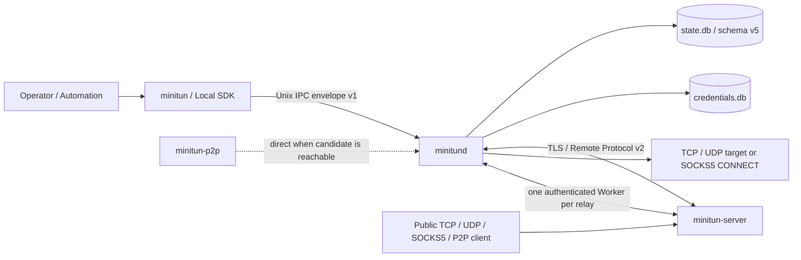

# System Architecture

The current MiniTun source consists of six public deliverables:

- `minitun-server`: public TLS/control listener, client policy, public tunnel listener and
  relay;
- `minitund`: local state, credentials, remote sessions, TunnelReconciler and local target
  connections;
- `minitun`: stateless CLI that only calls the daemon through the local Unix IPC;
- `minitun-p2p`: local connector for P2P tunnels that automatically uses the TLS relay when
  direct connection fails;
- `libminitun-client.so.1`: stable C ABI/C++20 control SDK using the same IPC as the CLI;
- `libminitun-remote-protocol.so.1`: standalone Remote Protocol v2 C++20 codec, incremental
  decoder and authentication digest helper.

MiniTun focuses on a minimal footprint: there is no web GUI, and the control plane is only
the CLI and the local SDK.



The CLI and SDK do not open the database directly; the server does not know the local
target address. Only the daemon can resolve an authenticated `tunnel_id` to a local
endpoint.

## Module boundaries

Shared modules are split by responsibility:

| Module | Responsibility |
| --- | --- |
| `common` | bounded ID/endpoint/port range, errors, logging, secret memory, version, failpoint |
| `protocol` | v2 frames, messages, HMAC, TLS, UDP framing, SOCKS5, P2P negotiation and fixed-buffer relay |
| `storage` | schema migration, repositories, transactions, online backup and the credential database |
| `ipc` | envelope v1, Unix transport, dispatcher, client |
| `daemon` | control service, declarative config, server session, worker pool, reconciler |
| `server` | client policy, authentication/session, tunnel registry, quota, worker pool |
| `admin` | bounded HTTP health, readiness and Prometheus endpoints |
| `sdk` | stable local C ABI/C++ wrapper, plus the standalone Remote Protocol C++ API |

`server.cpp` and `server_manager.cpp` remain asynchronous lifecycle orchestrators; policy
parsing, listener ownership, quota, worker pool, state convergence, declarative config and
admin HTTP each live in separate modules. Network async paths never hold a database
transaction across `co_await`.

## schema v5 and credentials

The `state.db` schema v5 contains:

- `daemon_identity`: the `client_...` ID, stable across restarts;
- `servers`: stable ID, optional unique name, endpoint, TLS server name, opaque credential
  references for PSK/CA/client cert/key, desired/actual state, remote server ID, reconnect
  info, `config_revision` and `managed_by_config`;
- `tunnels`: stable ID, optional name, immutable server ownership, `tcp`/`udp`/`socks5`/
  `p2p` mode, local endpoint, public bind host/port, desired/actual state, last sync time,
  `config_revision` and `managed_by_config`;
- the sequential `schema_version` migration history and constraints/indexes.

After opening a connection, WAL, foreign keys, synchronous mode, busy timeout, schema
definition, integrity and foreign keys are verified. Future schemas, drifted objects,
broken migration history or a non-empty database without a version all refuse to start and
are never automatically deleted or rebuilt.

Historical schema v4 (the v1.0 era) data is migrated to v5 by rebuilding the tunnel table
in a transaction; existing tunnels default to `tcp` and the public bind host defaults to
`0.0.0.0`. IDs, names, endpoints, tunnels and the original PSK references are preserved.
schema v1–v3 databases from the v0.x era are no longer supported; opening one is refused
directly without modifying the file. Old programs cannot open schema v5; rolling back
requires restoring the paired backups from before the upgrade.

Secrets live in a separate `credentials.db`; the state database only stores opaque
references. Each class of server credential uses two bounded rotation slots: write the
inactive slot first, switch the reference in the state transaction, then clean up the old
slot. Failures clean up staged items; startup recovery deletes slots not referenced by any
active record and converges a server missing its PSK to `not_authenticated`. logout deletes
the PSK, CA, client certificate and private key.

Database files must be regular files owned by the daemon with mode `0600`. Memory and IPC
buffers are actively cleared after secret use, but the local filesystem and the service
account remain within the trust boundary.

## Local IPC and control plane

The IPC envelope stays at version 1:

```text
uint32 network-order JSON length | UTF-8 strict JSON
```

The single-request limit is 1 MiB. Requests/responses have a canonical `req_` ID; a
response is either an object result or a stable error code plus a non-sensitive message.
Unknown fields, duplicate/malformed JSON, wrong types, over-long values and unsupported
versions are rejected before dispatch. Each local connection handles one time-bounded
request, and the dispatcher uses a bounded thread pool.

Public methods:

```text
daemon.status  daemon.identity  status  doctor  health  readiness  metrics  reload

server.add  server.login  server.update  server.enable  server.disable
server.logout  server.list  server.inspect  server.remove

tun.add  tun.update  tun.enable  tun.disable  tun.list  tun.inspect  tun.remove

config.export  config.plan  config.apply
```

The Unix socket is created by the daemon as `0660`; the parent directory, owner, group,
symlinks and stale inode are all validated, and a companion lock file serializes
replacement. The production default is `/run/minitun/minitun.sock`.

## Declarative configuration

`config plan/apply` first fully parses `format_version: 1` servers/tunnels and all
credential files. Resources match by ID first, and by unique name within the same type when
there is no ID. plan is read-only and its actions are stably sorted.

apply first writes new secrets into the inactive slot, then switches all resources and
references in one state transaction. Identical input produces zero actions and does not
wake unrelated sessions. By default only create/update; `--prune` only deletes resources
with `managed_by_config=true` that are missing this time, never imperative resources.

export contains no secrets or paths, only whether credentials are configured; omitting
`*_file` on a later apply means "keep the existing material".

## sessions and TunnelReconciler

Each server record has an independent `ServerSession`: TLS context, control connection,
heartbeat, exponential backoff, worker pool, operation timers and a random remote
generation. Changes to endpoint, TLS server name, CA or client identity only replace that
server's session.

`TunnelReconciler` assigns a monotonic generation to each local server session. The
registration window holds at most 32 entries, and each request records the frame request ID
and the desired revision at submit time. A response may only change the database when all
of the following hold:

1. the server ID and tunnel ID currently exist;
2. the session generation is still the current value;
3. the request ID is still in the current window and unfinished;
4. the response revision equals the tunnel's current `config_revision`.

Duplicate, out-of-order, timed-out or stale responses never resurrect old state. A
generation ending converges any residual `registering`, `removing` and `active` to
`pending` in one transaction. Changing the public port first unregisters the old listener,
then registers the new revision; a failed new bind keeps the new desired configuration and
an explicit error, leaving no old entry behind.

## server policy, ACL and quotas

The server atomically replaces the `clients.json` snapshot after full validation. Each
`client_id` has its own PSK, enabled state, public port range, maximum
tunnel/connection/idle Worker counts, and an optional certificate fingerprint or SAN.
Global caps constrain resources again on top of the client policy caps.

Both control and Worker TLS must satisfy the same policy. Authentication failures use a
uniform external error; the replay cache and failure rate limiting are bounded. Policy
changes immediately remove that client's listener and idle capacity; allocated relays drain
for at most `--shutdown-timeout`.

## Workers, transport mode and backpressure

The daemon isolates Worker Pools by server and generation, replenishing them adaptively
within the server's advertised min/max range; the server enforces per-client and global
idle Worker quotas simultaneously. A public connection only waits for a Worker after it
obtains a connection quota lease.

Each relay uses one authenticated TLS Worker. The daemon checks the database to confirm the
tunnel is still active, and verifies the capability for that mode was negotiated, before
establishing the data plane:

- `tcp`: connects a fixed local TCP target; after the handshake it relays raw bytes with a
  fixed 16 KiB buffer in both directions;
- `udp`: the server creates bounded sessions per public UDP peer, using 2-byte big-endian
  length and datagram records up to 65,507 bytes over the TLS Worker; the daemon connects a
  fixed local UDP target;
- `socks5`: the public TCP listener only accepts SOCKS5 no-auth `CONNECT`, supporting IPv4,
  IPv6 and domain; resolution and destination connection happen on the daemon side, and the
  public bind host is forced to a numeric loopback;
- `p2p`: the TLS Worker provides a one-time token and direct candidate; once both sides
  confirm a direct connection the server leaves the data path, otherwise it keeps relaying
  on the original TLS Worker.

All queues, peer sessions, records, handshakes and idle deadlines have explicit limits. TCP
half-close, reset, timeout and cancellation have deterministic resource-release paths; TLS
session cache/resumption lowers the handshake cost of Worker reconnects.

P2P direct suits LANs or routable addresses and does not implement ICE, STUN, TURN or NAT
hole punching. The one-time token first authenticates the candidate connection, then both
ends upgrade the socket to TLS 1.3 using the token as the external PSK; application data is
encrypted throughout with no additional certificate infrastructure.

## Admin endpoints and metrics

The daemon/server may enable the shared bounded HTTP implementation: `GET/HEAD /healthz`,
`GET/HEAD /readyz`, `GET /metrics`. Non-loopback requires a Bearer token, and the endpoint
itself does not provide TLS.

Daemon readiness requires the state database, credential database and IPC to be healthy,
not every remote online; server readiness requires TLS, policy and the control listener to
be started. Metrics only use the fixed labels `role/state/result/direction`, never
client/tunnel IDs or names, and counters reset on restart.

The audit component records policy reloads, authentication results, registration/
deregistration, ACL/quota rejections and local management operations; it does not record
PSKs, certificate contents, private keys, authentication digests or user traffic.

## Shutdown and failure boundaries

SIGINT/SIGTERM first stops the admin, control and tunnel listeners, rejects new work, and
best-effort sends GOAWAY. Active relays drain within `--shutdown-timeout` and are forcibly
closed when the deadline passes. A single session, parse error, local target failure or
tunnel bind conflict must not terminate other client/server sessions.

SIGHUP fully re-reads TLS and client policy on the server side; on the daemon side it
triggers a remote session reload. An invalid new config keeps the current snapshot. Timers,
queues, frames, connections, tunnels and Workers all have explicit limits.

## Non-goals

- No ICE/STUN/TURN/NAT hole punching; for a viable evolution path and acceptance criteria,
  see the [NAT traversal design proposal](/en/design/nat-traversal);
- No commitment to non-Linux runtimes; macOS is compile-tested only;
- The SDK does not embed the daemon/server runtime; the Remote SDK only provides the
  protocol codec/decoder/helper;
- No multiplexed relay by default; optional performance validation can provide the
  engineering evidence for whether to enable it later.
