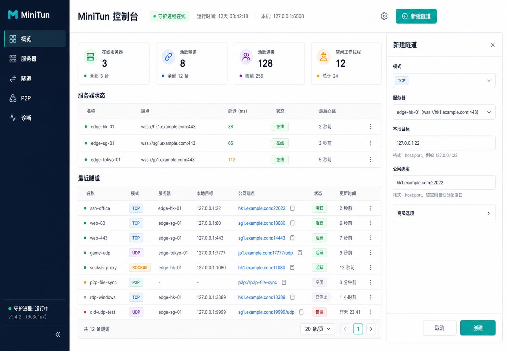

# Web 管理控制台

`minitun-gui` 是 `1.1.0` 源码新增的本地 Web 控制台。它提供 server、TCP/UDP/SOCKS5/P2P
tunnel、P2P 使用提示和诊断视图；所有数据来自 `minitund` Unix IPC，不直接读取 SQLite
或凭据。



## 启动

安装包已经包含构建后的静态资源：

```bash
sudo systemctl enable --now minitund.service
minitun-gui
# 打开 http://127.0.0.1:6500
```

开发构建应显式指向资源目录：

```bash
npm ci
npm run gui:build
./build/dev/minitun-gui \
  --socket /path/to/minitun.sock \
  --assets-dir "$PWD/gui/dist"
```

可用选项：

```text
--listen <numeric-loopback:port>  默认 127.0.0.1:6500
--socket <path>                   默认 /run/minitun/minitun.sock
--assets-dir <directory>         软件包默认 /usr/share/minitun/gui
```

## 安全边界

GUI 故意不提供公网认证层，只允许数值 IPv4/IPv6 loopback listener。需要从另一台机器
操作时使用具备认证和加密的 SSH port forwarding：

```bash
ssh -L 6500:127.0.0.1:6500 operator@daemon-host
```

后端限制 method、path、header/body 大小、并发和超时；静态路径经过规范化并拒绝
traversal 和符号链接逃逸。`Host` 必须是与实际 listener 一致的数值 loopback endpoint，
以阻断 DNS rebinding；JSON mutation 必须携带匹配 listener 的同源 `Origin` 和
`application/json` media type。响应默认设置 CSP、`X-Content-Type-Options: nosniff`、
frame 限制和 referrer policy；不启用 CORS。

不要使用端口转发、反向代理或容器发布把 GUI 暴露到不受信网络。若组织需要共享远程
管理，应在外部增加 TLS、强认证和访问控制，并保留 loopback 上游。

## 功能范围

- 查看 daemon 总览、server/session、tunnel 状态与诊断错误；
- 创建 TCP、UDP、SOCKS5 和 P2P tunnel；
- 启用或禁用现有 tunnel；后端受控 API 也支持 remove，CLI 可用于显式删除；
- 查看 P2P connector 命令、direct/fallback 安全限制；
- 响应式桌面与移动布局、键盘导航和可访问状态提示。

凭据登录、声明式批量 apply、数据库 restore 等高风险运维动作仍通过 CLI 完成，避免在
浏览器表面扩大秘密输入和恢复权限。
